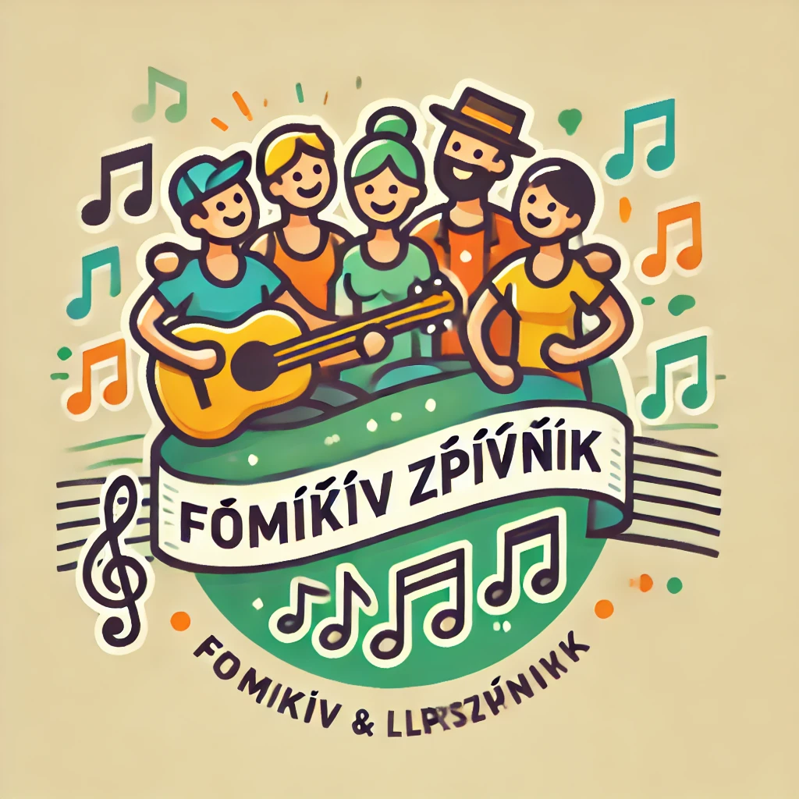

# Domčíkův Zpěvník v2
Welcome to the source code of my songbook, [available on Github Pages](https://tragram.github.io/domcikuv-zpevnik-v2/). It shows most of the songs I play without complaining and offers searching, filtering and sorting, as well as random song generation, transpositions etc.

### Previous version
For my high-school graduation project, I created the first version of this songbook, [hosted here](https://appelt.cz/domcikuvzpevnik/). It consisted of an [Android app](https://github.com/tragram/DomcikuvZpevnik) and a [PHP server](https://github.com/tragram/DomcikuvZpevnik-Server). Due to a lack of updates, the app was taken down from the Playstore by Google in 2024 and the website was suboptimal for viewing on mobile devices, which is the main use-case of the songbook. Since I no longer program in Java nor PHP, I decided to make a new version, so here we are.

## Editing songs
To edit a song, you can directly edit the source. Any push to the `main` branch triggers a new build of the website and the changes should be live in about 1 minute. If you don't have the necessary rights, you will have to make a pull request or let me know. ;)

The songs are defined in an extended [ChordPro](https://www.chordpro.org/chordpro/chordpro-introduction/) format and are located in `songs/`. This directory is then used to generate the song database during build. For clarity, the songs are named in the form `artist_name-song_name.pro` with any special characters converted to ASCII. There is no need to do this manually, you can just run the `scripts/format_songs.py` script to do it for you.

A song should have the following entries:
```chordpro
{artist: František Vomáčka}
{title: Svíčková}
{language: english}
{date_added: 02-2020}
{capo: 0}
{key: C}
{range: c1-f#2}
{tempo: 110}
```

Note that this project assumes the Czech/German note naming scheme, where the notes go as follows: `C C#/Des D D#/Es E F F#/Ges G G#/As A A#/B H C`.

### Extensions of the ChordPro format
Despite the ChordPro format being the only widely used, the specification lacks many nice-to-have features. For convenience, I have added the possibility to keep in memory more than one chorus. You can define the name of the chorus (note: it will be displayed!) in the directive by e.g. 
```chordpro
{start_of_chorus: R1}
content
{end_of_chorus}
{start_of_chorus: R2}
content
{end_of_chorus}
```
and them later recall them by 
```
{chorus: R1}
{chorus: R2}
{chorus: R1}
```
This is compatible with the feature that hides repeated choruses (it will then just show the name of the chorus for reference).

Keyword "bridge" works analogously to "chorus". Hiding/showing is controlled via the same toggle as for chorus.

### Image generation
Since it's 2024, I decided to use AI for tasks other than helping me code this thing. The `scripts/generate_images.py` script loads the lyrics of each of the songs and generates a prompt (in English) for an image generation model.

Because the songs are in many languages, it's currently (October 2024) necessary to use GPT-4o to generate the prompt based on the lyrics, as it has by far the best multilingual capabilities for random languages like Czech, Slovak, Finnish or Estonian. By default, the script uses GPT-4o-mini which still provides very satisfactory results (you can see for yourself in `songs/image_prompts`) at a fraction of the cost (around 0.01USD/50 songs).

Generating the prompt in English allows us to use any old image generation network. Because DALL-E 3 is pretty expensive (0.040-0.080$/image) and can only generate images that are 1024×1024 (which is too large/detailed for the thumbnails), I decided to just use the free [Hugging Face](https://huggingface.co/) API. In particular, I landed on the [FLUX.1-dev](https://huggingface.co/black-forest-labs/FLUX.1-dev) model.

To use the script, you need to provide your own `secrets.yaml` file with your API keys in the following format:
```yaml
hugging_face_token: YOUR_TOKEN
openai:
  api_key: YOUR_TOKEN
  organization_id: YOUR_ORG_ID
  project_id: YOUR_PROJECT_ID
```

For fun, I asked ChatGPT to generate a logo for this project. Well, let's just say that while letters in English have improved a lot, it still has issues with foreign characters.



### Scraping the web for lyrics & chords
When moving from the old PDF-based songbook, there was a need to recreate almost 300 songs in ChordPro. Naturally, some automation had to be done in order not to spend the rest of my life on this step.

If you define a `.pro` file with just the directives and no body, you can try running `scripts/scrape_songs.py`. It will use [Selenium](https://pypi.org/project/selenium/) perform a Google search on [Písničky Akordy](https://pisnicky-akordy.cz/), transpose it to the key specified in the header and download the contents into `songs/scraped/artist_name`. 

Songs from there *usually* are in their "standard" format but it's worth checking because it's easier to fix it at this step that:
* clearly separated verses/chords by an empty line
* verses start by e.g. "1. " (the space is necessary!)
* chorus starts by "R: "
* bridge starts by "B: "
* chords are above and aligned with the lyrics
If this holds, you can use the `scripts/chordpro_from_txt.py` and it will process the contents, inserting chords where appropriate (avoiding inserting the chords at the very start of the word in case of minor misalignments) and converting the verse numbers etc. into chordpro directives.

## Tech
Website built on React+Vite, styled by [TailwindCSS](https://tailwindcss.com) and [NextUI](https://nextui.org) and uses the following libraries:
* [Lucide](https://lucide.dev/): icons
* [ChordSheetJS](https://github.com/martijnversluis/ChordSheetJS): parsing Chordpro in JS
* [Fuse.js](https://www.fusejs.io/): fuzzy search
* [auto-text-size](https://www.npmjs.com/package/auto-text-size): automatic sizing of chords & lyrics
* [country-flag-icons](https://www.npmjs.com/package/country-flag-icons)

## TODO:
A lot ATM. The two major features to add are:
* A mode in which you only see the generated illustrations and will choose based on those. Might be interesting to "judge the book by its cover".
* Make the website a [PWA](https://en.wikipedia.org/wiki/Progressive_web_app) to make it available 100 % offline.
